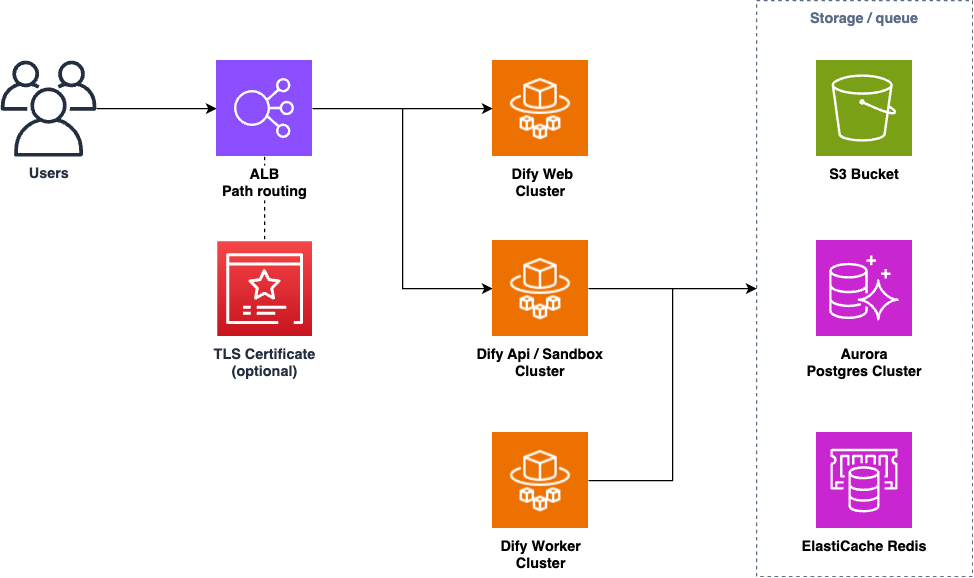
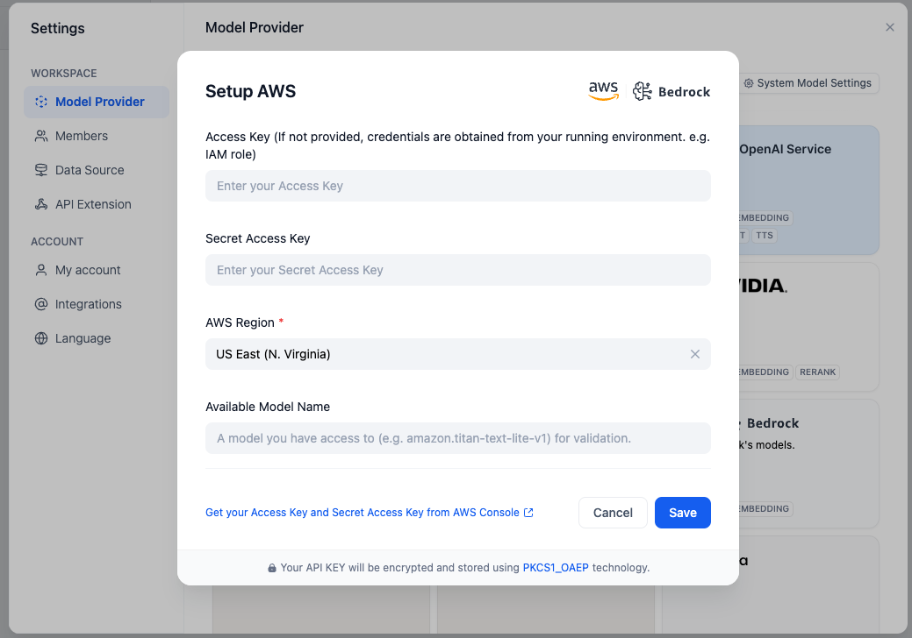

# DifyをAWS上にCDKでデプロイ

[](https://github.com/tmokmss/dify-on-aws-cdk/actions/workflows/build.yml)

AWSのマネージドサービスを使って、LLMアプリ開発プラットフォームである[Dify](https://dify.ai/)をAWS CDKでデプロイ



## 主な特徴

* メンテナンスが少ないフルマネージドサービス
    * Aurora serverless v2、ElastiCache、ECS Fargateなど
* コスト効率の良いアーキテクチャの選択
    * NAT Gatewayの代わりにNATインスタンスを利用し、デフォルトでFargateスポットキャパシティを使用
* IAMロールを使用してBedrockとネイティブに統合

詳細は[こちら](https://note.com/yukkie1114/n/n0d9c5551569f)

## 前提条件

このアプリをデプロイするには、以下の依存関係をインストールしておく必要がある

* [Node.js](https://nodejs.org/en/download/) (v18以上)
* [Docker](https://docs.docker.com/get-docker/)
* [AWS CLI](https://docs.aws.amazon.com/cli/latest/userguide/getting-started-install.html)と管理者権限のあるIAMプロファイル

## デプロイ手順

AWSリージョンなどの設定パラメータは[`bin/cdk.ts`](bin/cdk.ts)を編集して調整する。また、すべての利用可能なパラメータについては[`DifyOnAwsStackProps`インターフェース](./lib/dify-on-aws-stack.ts)も確認する

次に、以下のコマンドを実行してスタック全体をデプロイ

```sh
# npm依存関係をインストール
npm ci
# AWSアカウントをブートストラップ (アカウントおよびリージョンごとに一度だけ必要)
npx cdk bootstrap
# CDKスタックをデプロイ
npx cdk deploy
```

初回のデプロイは通常約20分かかる。デプロイが成功すると、アプリのURLが取得できる

```
 ✅  DifyOnAwsCdkStack

✨  デプロイ時間: 326.43s

Outputs:
DifyOnAwsCdkStack.ApiGatewayApiEndpoint015055E7 = https://xxxxxxxxx.execute-api.us-east-1.amazonaws.com
```

ブラウザでURLを開き、アプリを開始する

## DifyでBedrockを使用する設定

ログイン後、Bedrock LLMを使用するようにDifyを設定可能

> [!重要]  
> Difyでモデルを設定する前に、Bedrock管理コンソールで使用するモデルを**有効化**する必要がある。詳細については、[このドキュメント](https://docs.aws.amazon.com/bedrock/latest/userguide/model-access.html#model-access-add)を参照

画面右上のプロフィールから設定に進み、`WORKSPACE -> モデルプロバイダー`をクリックし、`AWS Bedrock model`を選択

IAMポリシーは適切に設定済みなので、正しいAWSリージョン（モデルが有効化されているリージョン）を選択し、`保存`をクリック



## コード実行で利用可能なPythonパッケージを追加

Difyのコード実行機能で使用するPythonパッケージを追加可能。 [sandbox-python-requirements.txt](./lib/constructs/dify-services/docker/sandbox-python-requirements.txt)を[Requirements File Format](https://pip.pypa.io/en/stable/reference/requirements-file-format/)に従って編集する

一部のライブラリでは、Difyサンドボックス内で追加のシステムコールを許可する必要がある。このCDKプロジェクトでは、[`bin/cdk.ts`](bin/cdk.ts)の`allowAnySysCalls`フラグを使ってすべてのシステムコールを許可できる

> [!警告]
> `allowAnySysCalls`フラグを有効にする場合、Difyテナント内で実行されるコードが完全に信頼できることを確認する必要がある

詳細については、こちらのブログ記事も参照: [Difyのコードブロックで任意のPythonライブラリを使用](https://tmokmss.hatenablog.com/entry/use-any-python-packages-on-dify-sandbox)

## クリーンアップ

将来的な課金を避けるために、作成したリソースをクリーンアップする

```sh
npx cdk destroy --force
# 削除中にエラーが発生した場合は、再試行すること。たまに発生することがある
```

## ライセンス
このリポジトリ内のコードはすべてMITライセンスと[Difyのライセンス](https://github.com/langgenius/dify/blob/main/LICENSE)を元に作成されている。